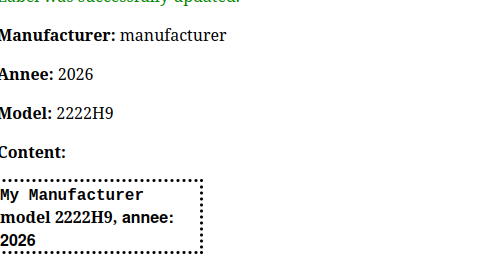
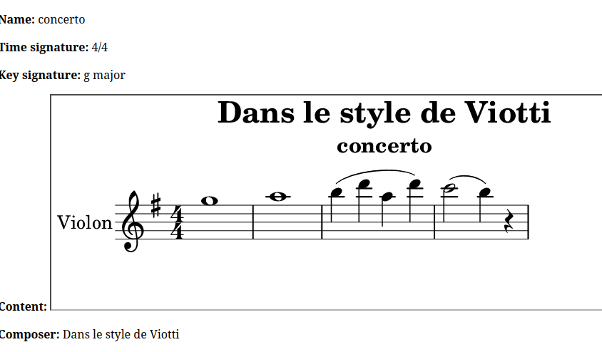

# README

- create a label as a manufacter for violin

- in the style of Violin  manufacturers
- and create a score to play in the style of Viotti, Bach, 
- faire rails c , et "require "./hey""
# violin-label
